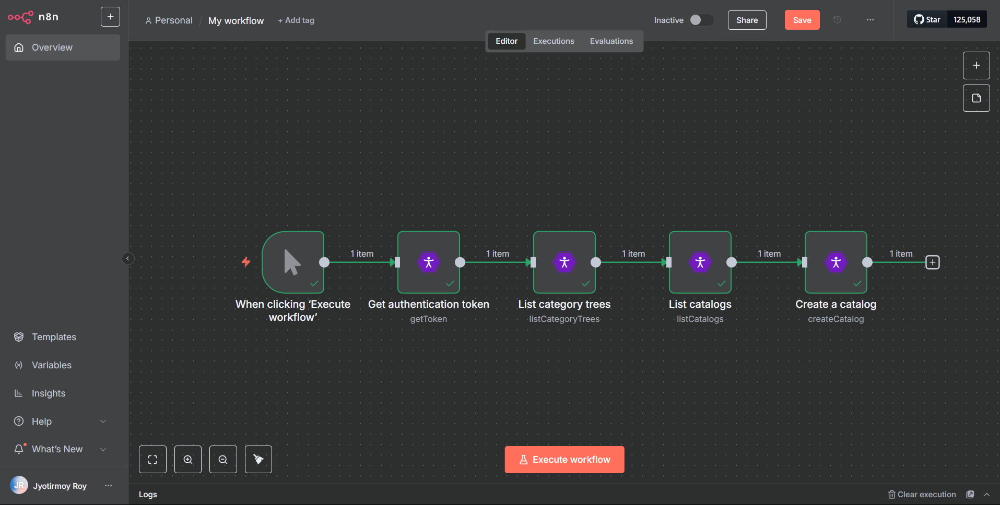
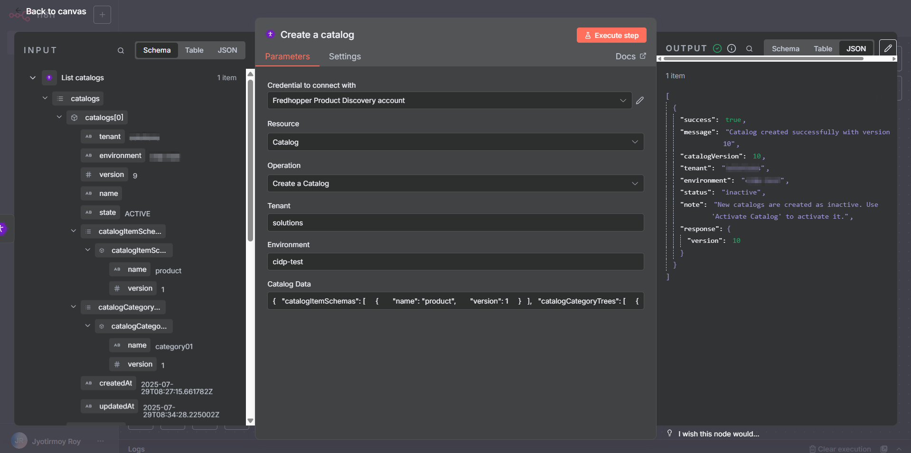

<a href="http://www.crownpeak.com" target="_blank">
  
</a>

# n8n-nodes-crownpeak-pd

## Overview

This repository provides a custom n8n integration node for the [Fredhopper Product Discovery API](https://crownpeak.gitbook.io/product-discovery). It enables direct access to product discovery operations such as authentication, item management, catalog, category tree, and locale configuration within an n8n workflow.

## What is it?

An n8n node module designed to simplify integration with Crownpeak Fredhopper Product Discovery's API using secure credential management. It supports:

- Secure authentication using username/password and OAuth2 token endpoint
- Manage product items: create, update, delete, and upsert
- Manage item schemas and catalogs
- Manage category trees and locale settings
- Chain operations using dynamic expressions for automated product data pipelines

## What is it for?

This module is useful for organizations looking to build automated product onboarding, enrichment, and publishing pipelines into the Crownpeak Fredhopper ecosystem.

---


## Supported Resources & Operations

| Resource         | Operations Supported                  |
|------------------|----------------------------------------|
| Authentication   | Get Token                             |
| Schema           | List All Schemas                      |
| Product Items    | Upsert, Patch, Delete                 |
| Item Schemas     | Create, Get, Update, Delete           |
| Batch Operations | Create, List, Add Items, Modify Items, Delete Items, Submit Ingestion, Get Status, List Ingestions, Delete Ingestion |
| Catalogs         | List, Get Active, Create, Create with Default Batch, Activate, Delete  |
| Category Tree    | List, Get, Create, Update, Delete     |
| Locales          | Get, Set, Delete                      |
| Feedback         | Catalog Activation Statistics, Created Catalog Versions, Summary of Updates (with various filters), List Updates (with various filters), Single Update Feedback |

---

## Complete API Operations Reference

### Authentication
| Feature | Method | Endpoint | Description |
|---------|--------|----------|-------------|
| Get Token | POST | /auth/realms/{tenantId}/protocol/openid-connect/token | Obtain OAuth2 authentication token |

### Schema Operations
| Feature | Method | Endpoint | Description |
|---------|--------|----------|-------------|
| List All Schemas | GET | /item-schemas | List all item schemas for a tenant/environment |

### Item Operations
| Feature | Method | Endpoint | Description |
|---------|--------|----------|-------------|
| Upsert Items | POST | /items | Create or update product items |
| Patch Items | PATCH | /items | Partially update existing product items |
| Delete Items | POST | /items/delete | Delete product items |

### Item Schema Operations
| Feature | Method | Endpoint | Description |
|---------|--------|----------|-------------|
| Create an Item Schema | POST | /item-schemas | Create a new item schema |
| Update an Item Schema | PUT | /item-schemas/{name} | Update an existing item schema |
| Get an Item Schema | GET | /item-schemas/{name}/{version} | Get an item schema by name and version |
| Delete an Item Schema | DELETE | /item-schemas/{name}/{version} | Delete an item schema |

### Batch Operations
| Feature | Method | Endpoint | Description |
|---------|--------|----------|-------------|
| Create Batch | POST | /batch-imports | Create a new batch for bulk item operations |
| List Batches | GET | /batch-imports | List all batches |
| Add Items to Batch | POST | /batch-imports/items | Add items to an existing batch |
| Modify Items in Batch | PATCH | /batch-imports/items | Modify items in an existing batch |
| Delete Items from Batch | POST | /batch-imports/items/delete | Delete items from an existing batch |
| Submit Batch Ingestion | POST | /batch-imports/ingestions | Submit batch for processing into a catalog |
| Get Batch Ingestion Status | GET | /batch-imports/ingestions/{id} | Get status of a specific batch ingestion |
| List Batch Ingestions | GET | /batch-imports/ingestions | List all batch ingestions with optional filters |
| Delete Batch Ingestion | DELETE | /batch-imports/ingestions/{id} | Delete a batch ingestion |

### Catalog Operations
| Feature | Method | Endpoint | Description |
|---------|--------|----------|-------------|
| List Catalogs | GET | /catalogs | List all catalogs |
| Get Active Catalog Version | GET | /catalogs/active | Get the currently active catalog version |
| Create a Catalog | POST | /catalogs | Create a new catalog version |
| Create Catalog With Default Batch | POST | /catalogs?createBatchImport=true | Create a catalog and automatically create a default batch (batch_id = catalog version) |
| Activate a Catalog Version | POST | /catalogs/activate/{version} | Activate a specific catalog version |
| Delete Catalog | DELETE | /catalogs/{version} | Delete an inactive catalog version |

### Category Tree Operations
| Feature | Method | Endpoint | Description |
|---------|--------|----------|-------------|
| List Category Trees | GET | /category-trees | List all category trees |
| Get a Category Tree | GET | /category-trees/{name}/{version} | Get a category tree by name and version |
| Create a Category Tree | POST | /category-trees | Create a new category tree |
| Update a Category Tree | PUT | /category-trees/{name} | Update an existing category tree |
| Delete a Category Tree | DELETE | /category-trees/{name}/{version} | Delete a category tree |

### Locale Operations
| Feature | Method | Endpoint | Description |
|---------|--------|----------|-------------|
| Get Default Locale | GET | /locales/default | Get the default locale |
| Set Default Locale | POST | /locales/default | Set the default locale |
| Delete Default Locale | DELETE | /locales/default | Delete the default locale |

### Feedback Operations
| Feature | Method | Endpoint | Description |
|---------|--------|----------|-------------|
| Catalog Activation Statistics | GET | /feedback/catalog-version/{version}/full/statistics | Get catalog creation and activation statistics |
| Created Catalog Versions | GET | /feedback/catalog-version | Get history of created catalog versions |
| Summary of Updates | GET | /feedback/catalog-version/{version}/updates/statistics/summary/relative | Get summary of updates in the last specified period |
| Summary of Updates (Time Window) | GET | /feedback/catalog-version/{version}/updates/statistics/summary/absolute | Get summary of updates within a specific time window |
| Summary of Updates (By State) | GET | /feedback/catalog-version/{version}/updates/statistics/summary/{state}/relative | Get summary of updates with specified state (SUCCESS/FAILURE/PENDING) in the last period |
| Summary of Updates (By State & Time) | GET | /feedback/catalog-version/{version}/updates/statistics/summary/{state}/absolute | Get summary of updates with specified state within a time window |
| List Updates (By State) | GET | /feedback/catalog-version/{version}/updates/statistics/details/{state}/relative | Get detailed list of updates with specified state in the last period |
| List Updates (By State & Time) | GET | /feedback/catalog-version/{version}/updates/statistics/details/{state}/absolute | Get detailed list of updates with specified state within a time window |
| Single Update Feedback | GET | /feedback/catalog-version/{version}/updates/{receiptId} | Get detailed feedback for a specific update by receipt ID |

Each method supports query parameterization using dynamic expressions and securely authenticates using credentials.

## Installation & Usage

### As a Private Node
1. Clone this repository to your local machine:
   ```sh
   git clone https://github.com/Crownpeak/n8n-nodes-crownpeak-pd.git
   ```
2. Build the node module:
   ```sh
   cd n8n-nodes-crownpeak-pd
   npm install
   npm run build
   ```
3. Copy the `dist/` folder to your n8n instance's custom nodes directory:
   ```sh
   docker cp ./dist n8n-dev:/home/node/.n8n/custom-nodes/crownpeak-pd
   ```
4. Restart your n8n Docker container:
   ```sh
   docker restart n8n-dev
   ```
5. Log in to n8n and the node will appear as Fredhopper Product Discovery.

> ℹ️ If it doesn't appear, ensure you are mounting or copying to the correct container path and that `NODE_FUNCTION_ALLOW_EXTERNAL` is not overly restricted.

### As a Community Node (once approved)
Once this node is approved and published on the official [n8n integrations registry](https://n8n.io/integrations), installation will be as simple as:
```sh
n8n install n8n-nodes-crownpeak-pd
```
And in `n8n@1.100.0+` via the UI:

1. Open Settings → Community Nodes
2. Click Install a Community Node
3. Search or paste: `n8n-nodes-crownpeak-pd`
4. Click Install

---

## 📸 Screenshots
1. A basic workflow example using n8n Crownpeak PD Node
   

2. The result of /items POST
   

---

## Credentials

This node supports authentication against the Crownpeak Product Discovery API. You’ll need the following credentials:

- Username and Password
- OAuth2 Token URL

Refer to the [Product Discovery documentation](https://crownpeak.gitbook.io/product-discovery/) for full details on credential setup.

---

## Support

- This repository is maintained by Crownpeak and released under the MIT License.
- For Crownpeak platform questions, please contact your Customer Success Manager or [support@crownpeak.com](mailto:support@crownpeak.com).
- For n8n integration issues or pull requests, use GitHub Issues or Discussions.

## License

MIT © Crownpeak Technology, Inc.
See [LICENSE](./LICENSE) for details.
